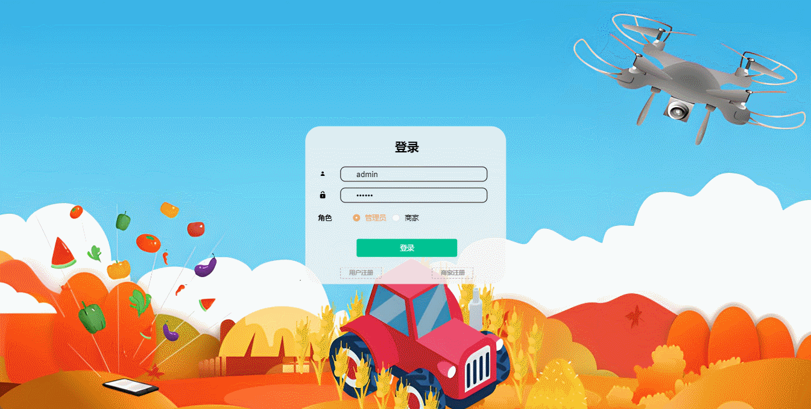

# assisting-farmers🎂

基于SpringBoot+Vue的助农平台

## 介绍🌞

> 目前，我国农产品产销过于分离，导致农产品产销相对失衡。农产品质量安全存在差异和偏差，推进农产品开发、品种改良、技术更新困难等一系列问题。论文以“服务农业、惠农、助农”理念，打造科技使者基地集系统、电商系统、市场反馈系统于一体，多主体一体化的特色助农平台；实现多功能、多价值，推动农产品供销模式由产销分开向产销合一转变。平台围绕农业生产、政府监管、企业销售、市场反馈等各个方面进行设计，每个环节的周期性交互。


## 项目演示🌞

> 用户端


> 商家


> 管理端



## 安装教程🌞

```
1. 运行环境准备mysql8 + java8 + node14.16.1

2. 配置maven路径，加载依赖

3. 运行sql文件，确保application.yml或config.properties的数据库名称和账号密码是数据库所在主机的账号密码
```


## 使用说明🌞

```
1. 登入
	
	管理员账号：admin	密码：123456

    商家账号：luolaoban	密码：123456

    客户账号：zhangsan	密码：123456
  
2. 运行流程

SpringBoot+Vue项目的部署详情可以查看这篇CSDN博客：http://t.csdnimg.cn/kpuxS

前后端不分离项目的部署流程可以查看这篇CSDN博客：http://t.csdnimg.cn/CslA5
```


## CSDN项目合集🌞

点击前往：http://t.csdnimg.cn/Q4u84


## 联系我🌞

**有偿获取完整源码或调试代码**

🐧：1902317191

微信：


